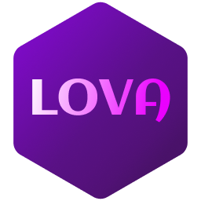

**Lova** - A Programming Language Built for Bash Coding Without Pain

# Features
- **Security** - from the flags `set -euo pipefail`, convenient syntax and defer security is increased many times over
- **Fast** - Transpilation of 150 lines of code takes 250-350 milliseconds
- **Simplicity** - There are no OOP, generics and extra things that need to be learned, the language is easy


# Examples

## Lova
```bash
pwd
defer ls -la
```
## Bash
```bash
#!/bin/bash
set -euo pipefail
IFS=$'\n\t'

trap 'ls -la' EXIT

pwd
```

## Lova

```bash
proc hypers = "Lova!"
proc two_hypers = "NN!"
proc you = "Boy!"

function tur(){
    printn "\t{hypers}"
    printn "\t{two_hypers}"
    printn "\t{you}"
}

tur
```

## Bash

```bash
#!/bin/bash
set -euo pipefail
IFS=$'\n\t'

hypers="Lova!"
two_hypers="NN!"
you="Boy!"

tur () {
printf "%b\n" "\t${hypers}"
printf "%b\n" "\t${two_hypers}"
printf "%b\n" "\t${you}"
}

tur
```

## Lova
```bash
// 1. Declare the array
arr [my_array] = ["Apple", "Banana", "Orange"]

// 2. Print all array elements (using [!] which parses to [@])
printn "All elements: [my_array][!]"

// 3. Append new elements
[my_array].append("Pear", "Kiwi")
printn "After append: [my_array][!]"

// 4. Delete element at index 1
[my_array].delete(1)
printn "After deleting index 1: [my_array][!]"
```

## Bash
```bash
#!/bin/bash
set -euo pipefail
IFS=$'\n\t'


my_array=("Apple", "Banana", "Orange")


printf "%b\n" "All elements: ${my_array[@]}"


my_array+=("Pear", "Kiwi")
printf "%b\n" "After append: ${my_array[@]}"


unset 'my_array[1]'
printf "%b\n" "After deleting index 1: ${my_array[@]}"
```

# Speed in 10 line
`[nn@endeavour test]$ lova -r new.lova
Translate: new.lova :: new.sh..
LOVA: Ready ::
LOVA: Time compile: 1.440137ms
	Lova!
	NN!
	Boy!
`

# Why create lova?
>Lova was created as a lighter replacement for Bash as Bash has terrible syntax and outdated design

# Documentation
-> [Guide / Documentation](guide/documentation.md)
